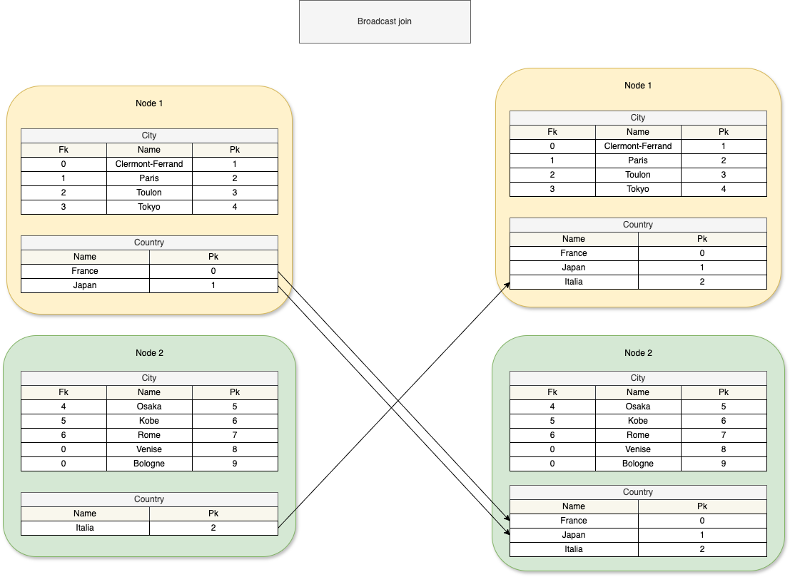
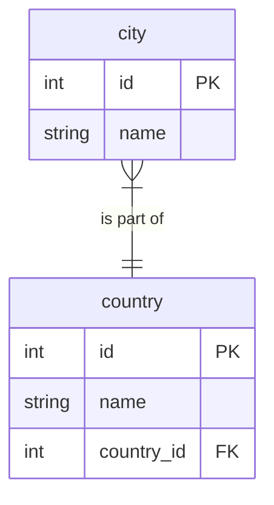

# Optimisation of join query over distributed database

## Context

In large-scale database systems, our aim is to enhance query performance through optimized join algorithms. 
Various algorithms exist, each with its own set of advantages and drawbacks.

### Glossary

- **Cluster**: Refers to a database system comprising multiple nodes. It stores data and executes queries across these servers.
- **Node**: Represents a unique server within the database system. Multiple nodes make up the distributed database system and handle query processing.
A node accepts and stores a subset of the database. During query execution, it exchanges data with other nodes to generate a partial result set, which it then sends to the driver.
- **Driver**: Acts as a server responsible for managing other nodes. It dispatches subsets of tables or rows to other nodes and aggregates query results from each node to produce the final result.

### Assumption

- Datas are randomly distributed across the nodes.
- The data quantity is evenly distributed across each node.

> Note:
> On hadoop, the data are split on block of 128Mb of data.

## Join strategy

### Broadcast join

In this join strategy, we distribute one of the two tables across all nodes. 
This allows each node to process the query using its subset of the first table. Subsequently, all the sub-results are collected by the driver and merged together



In this example the table country is broadcast to all other nodes.

The effectiveness of a broadcast join heavily relies on the size of the broadcasted table. When a table with N rows is broadcasted across a system with M nodes, the network needs to transfer N * M rows. Additionally, each node must accommodate these rows in memory and execute a join operation with all the broadcasted table's rows. Assuming the broadcasted table has N rows, the other table within each node has K rows, and the join operation employs a double nested loop, the workload on each node becomes N * K.

### Shuffle join

In this join strategy, we select nodes to execute a join operation over a subset of data. There are various methods to partition the data and distribute it among the nodes.

For example, consider the following relation:



If we want to perform :

```s
SELECT * 
FROM city
INNER JOIN country city.country_id == country.id
```

Each node can implement the following algorithm to shuffle they datas:

```{r, eval = FALSE}
INPUT :
    M <- Number of node
    T <- Tables in our node
    n <- Name of the column we want to join on
    curr_node <- Current node
    
START :
    for table in T do
        for row in table do
            affected_node = row[n] % M
            if curr_node != affected_node do
                sendRowToNode(affected_node, table.name, row)
                remove(T[table][row])
            end if
        end for
    end for
```


In the context of minimizing computing time in shuffle join, the optimal data distribution involves avoiding heavy hitters, such as countries with a large number of cities.

## TinyDistribDB

To assess the performance of different join strategies on distributed databases, I developed TinyDistribDB, an in-memory distributed database virtual environment. 
It monitors each event that occurs during the execution of a join query.

### Assumption

- Data is randomly distributed across the nodes.
- The quantity of data is evenly distributed across each node.
- Network workload is defined as the number of rows transferred over the network.
- Node workload is represented by the computational cost of a double nested loop between two tables. This excludes considerations of reading, writing, and I/O operations.
- Cluster workload is represented by the maximum cost among all its nodes. Assuming all nodes are equal and perform the join operation in parallel.

## Experiment

Find here the description of each experiment.

### Exp. 1

Show the correctness of the shuffle and broadcast join strategy.

### Exp. 2

Show how to perform join on large dataset (randomly generated).

### Exp. 3

Show the impact of the broadcast table on the network workload.
